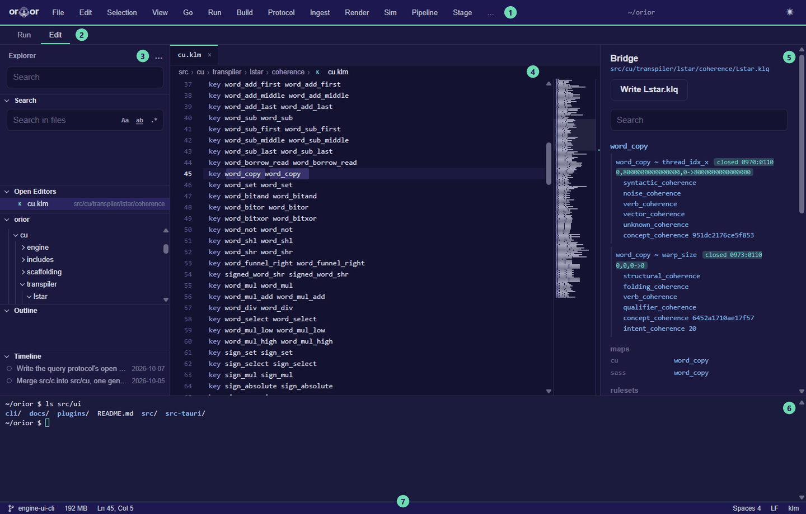
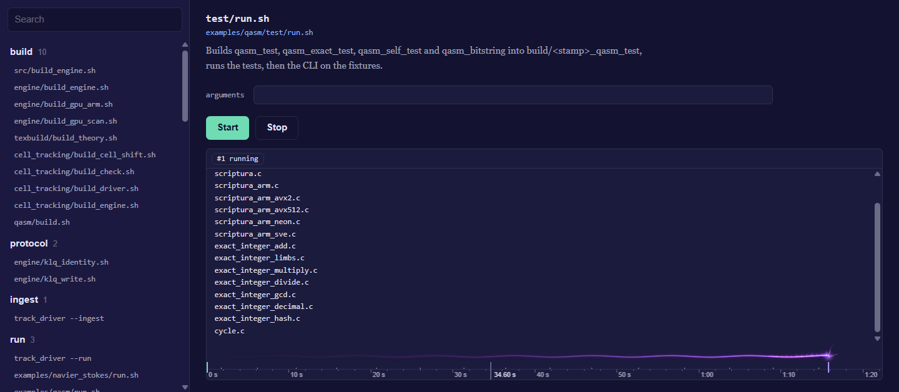
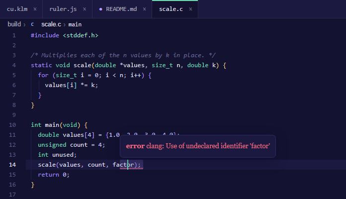
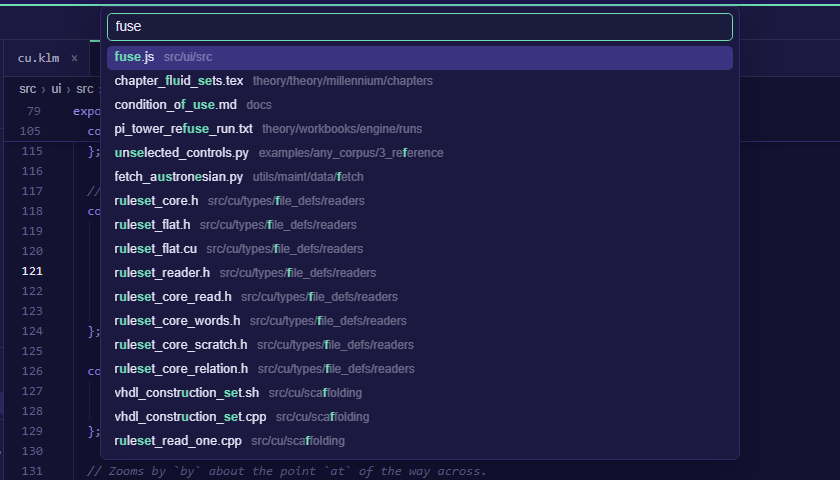
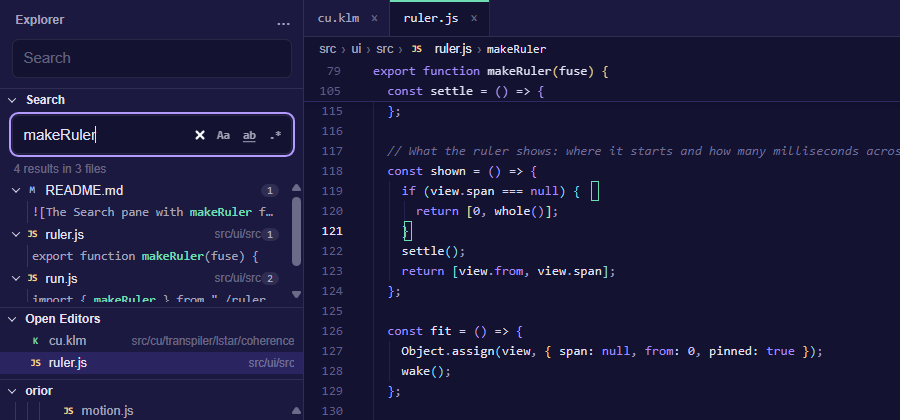
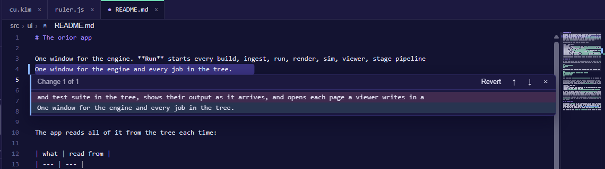
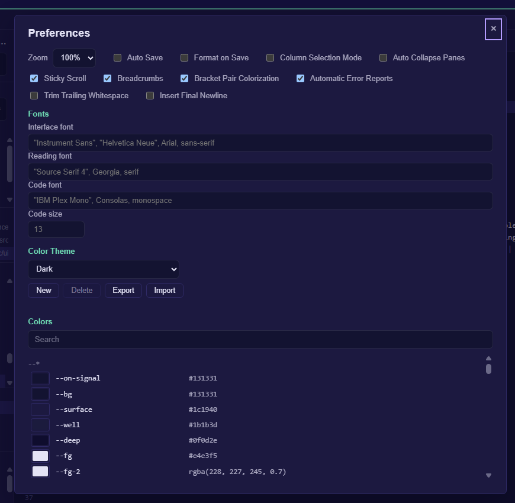
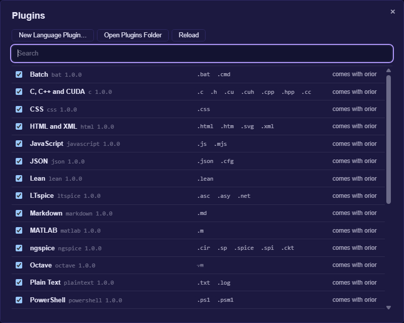
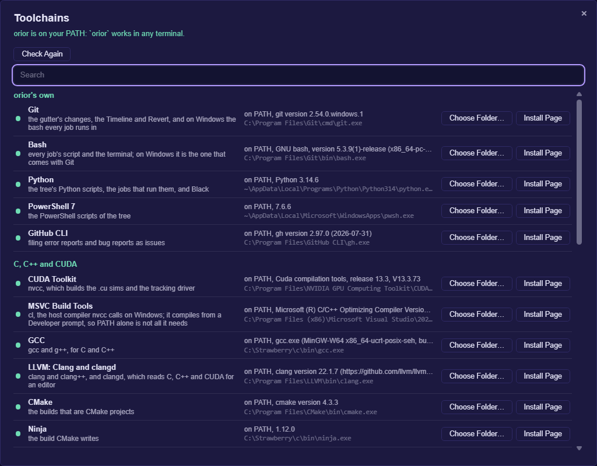

# Orior: a unified computational foundation

**Purpose:** Find an object's information entropy, and compile the program that measures it to any part.
**Scope:** the whole repository; [the site](https://dstroy0.github.io/orior/) holds the rest

[Setup](docs/setup.md) · [The app](#the-app) · [Using it](docs/usage.md) · [The algorithm](docs/method.md) · [The engine](docs/engine.md) · [Areas of research](docs/research.md) · [Licensing](docs/licensing.md)

Orior finds the pattern in anything, from a crystal to a language to a file. It compares the thing with a shuffled copy of itself, and the pattern is what the copy lost. Every number is exact, with nothing rounded, guessed or trained.

Some of what follows will read as too much, and a reader who has met claims like these before has every reason to doubt them. Nothing here asks to be believed. Every result names the file that holds it and the run that checks it, every one was measured against a null that could have said no, and every claim the work took back is kept beside the measurement that took it back.

Most of the parts are old, and they are named as old. The shuffle is a permutation null. Exact integers of any width are what every big number library holds. The new parts are an engine that never leaves exact integers, from the first read to the last bit written, and what came back when it was pointed at a crystal, a language, a digest and a camera.

## What is here, and how to check it

1. **Exact integers, from end to end.** Every number in the engine is an integer of whatever width it needs. Nothing is rounded, a tie is broken by name and never by noise, and a value too wide for its word is refused instead of cut. Pi to ten million digits, checked against a second series that shares no arithmetic with the first, is a test the engine runs on itself and not a record. [The engine](docs/engine.md) · [Precision](theory/theory/precision)

2. **The pattern is what a shuffle destroys.** Keep an object's counts and shuffle its arrangement, and the shuffle is the maximum entropy background, built from the object with nothing chosen. Any part of a pattern is a necessary condition for it, and a filter built from any subset therefore never loses a true occurrence: 9,396,207 on byte strings and 213,840 across one to eight dimensions, none refused. The part cannot rebuild the whole, and the exact compare stays. [The algorithm](docs/method.md) · [The sift](docs/sift.md) · [Delta Null](theory/theory/delta_null)

3. **The number of dimensions is not in the state.** The filter holds one bit for each alignment, alive or dead. Neither the size of the alphabet nor the number of dimensions appears in that state, and neither needs a bound. The same expression gives the cost from a line to an eight dimensional cube, set by one number, the collision entropy, and the two sizes. What still grows is the field: one bit for each place a pattern could sit. [Delta Null, Section 5.1](theory/theory/delta_null)

4. **Exact steps join before any input exists.** When every step is exact, a chain of steps composes into one program and runs on the device as one. Run one after another, each round of the chain pays to start, to wait and to carry its state through memory. Seven hundred of them laid as one stack run 13 to 22 times faster than the same seven hundred run one after another, and every record comes out equal. It runs the same steps, and what it removes is the time between them. [Vertical time compression](theory/workbooks/engine/vertical_time_compression.md)

5. **Compression held to the noise of the camera.** No program computes the Kolmogorov complexity of a file, and nothing here claims to. On 25 volumes of cell tracking, the noise read off the response of the camera itself puts a floor at 38.9 percent of raw. The engine writes them at 42.0, and every volume comes back voxel for voxel. [Compression](theory/workbooks/compression)

6. **One program at every width.** Sums, differences, products, exclusive or and AND read only the lowest bits of what they are given, and a program of them gives the same answer at every width. The emitter writes such a program to PTX, C or SASS with each target's rules held as data, and where a rule is not known it asks the part and keeps the answer. On the device, the part that writes the text writes its own text byte for byte. For the lambda calculus written in bits, two exact bounds put Chaitin's Omega below one eighth, and its first two bits are proved. [Two crystals](theory/workbooks/engine/two_crystals.md) · [The engine, part by part](theory/workbooks/engine/engine_table.md)

7. **Laplace's demon, and its bill.** The demon knows a boundary and computes what is inside. Measured, a boundary can refuse and cannot predict: a point it has excluded is excluded for good and for free, and no proper part of a pattern determines the rest. Reading finer detail off a boundary needs precision that grows exponentially as the detail gets finer. There is no wall of principle in the way, only that bill. The resemblance to physics is an analogy, and nothing here tests it. [Thought experiments](theory/thought_experiments/orior)

8. **What an input stops reaching is a clock.** A value that stops depending on an input is a hard fact the machine gets for free. In SHA-256, no input reaches 214 of 256 positions at round seven, the support grows by about nine a round, and it closes near round 30 of 64. Nothing here claims a weakness in SHA-256. [Instruments](theory/theory/instruments) · [Cryptography](theory/theory/cryptography)

9. **Precision spread.** Given seeds to enough places, every quantity an exact identity reaches comes out to the same places. Two seeds, the square roots of 2 and 3, give 2,230,148 exact square roots up to 10^800. [Precision](theory/theory/precision)

## What it does not claim

- It does not compute Kolmogorov complexity. It bounds a file from above, by writing it.
- It claims no weakness in SHA-256.
- It does not hold every quantum state in a few numbers. A state as plain as 100 quantum bits all 0 or all 1 together fits in 792, and a general state of 100 still needs 2^100.
- It is not a model and nothing in it is trained.
- Several results were found first by others, and where that is known the published work is named.
- [Thought experiments](theory/thought_experiments) holds the ideas whose experiment cannot be built as written. They are kept apart from the results, and none of them is one.

## Quick start

From a fresh clone, at the repository root:

```sh
utils/maint/engine/build_engine.sh                                  # the C engine: configure, build, run the graders
python examples/any_corpus/4_measure/collision_entropy.py           # a reading that knows nothing about its corpus
python examples/crystallography/6_oracle/proof_positive_control.py  # the positive control, against published cells
sh utils/maint/texbuild/build_theory.sh                             # the research papers
```

On Windows PowerShell the engine builds with `utils/maint/engine/build_engine.ps1`. Python needs only `numpy` to start. [Setup](docs/setup.md) covers the rest.

## The app

`orior` is one program with two faces: a window that runs every job in the tree and edits its files, and a command line over the same jobs. Most of what follows is done from the window, and every menu command is a word at the command line as well.

### Get started

It needs Rust 1.77 or later. From a fresh clone:

```sh
cd src/ui/src-tauri
cargo run                       # build it and open the window
cargo run -- run list           # the same program given words, with no install
```

The window works on the tree it starts in, or the one `ORIOR_ROOT` names. Started anywhere else, it asks for a folder, and File, Open Folder moves it to another tree at any time. Each tree keeps its own open tabs. [The app's own page](src/ui/README.md) covers the installers, what each platform needs, and where the window reads each job from.

### The window



| | part | what it holds |
| --- | --- | --- |
| 1 | Menu bar | File, Edit, Selection, View, Go and Run, a menu for each kind of job, Terminal and Help. A key shown beside a command runs it from anywhere in the window. |
| 2 | Run and Edit | the two views, a tab each on the line under the menus. Run holds every job the tree holds, the values each takes and each run's output; Edit holds the parts below. Ctrl+Shift+D shows Run and Ctrl+Shift+E shows Edit, and with a tab holding the keys, Left and Right switch. |
| 3 | Explorer | the panes Search, Open Editors, the tree's files, Outline and Timeline. Its … menu shows or hides each pane. |
| 4 | Editor | a tab for each file, the breadcrumbs over it, and the minimap down its right edge |
| 5 | Definitions | the definition of the open file's type, and in a coherence file, the bridge |
| 6 | Terminal (Ctrl+`) | a shell in the tree's top folder, under both views |
| 7 | Status bar | the branch, with a star where a file differs from the last commit; the runs going; the memory the app and every process it started hold, each part shown on hover. In the Edit view, the cursor's line and column, the selection, the indent, the line ends and the language. |

The panes at the sides collapse toward their edge a moment after the pointer leaves them, and the pointer at that edge brings them back. Ctrl+B shows or collapses the view's own pane, and View, Auto Collapse Panes keeps them open. While the window's frame is dragged or its edges pulled, every animation stops and each moving picture holds as a still one, and they take up where they stopped when the drag ends.

### Run a job

1. Choose the Run tab (Ctrl+Shift+D), or open the menu for the kind of job: Build, Protocol, Ingest, Render, Sim, Pipeline, Stage or Test.
2. Choose the job. The arrow keys move through the list, and a job's description is the opening comment of its own file.
3. Set its values and press F5 to start it. Shift+F5 stops it.



The output streams as it comes. The fuse along its foot burns on the time ruler under it, its head at the run's latest moment, and it flashes when the run ends well and sputters dark when it fails or is stopped. The ruler marks where each step started and where the output came, red where it went to stderr. The wheel over either one, or + and - with the ruler holding the keys, zooms the time down to a few milliseconds across; a drag or Left and Right moves it, and 0 or a double click fits the whole run again. A page a viewer writes opens in a window of its own.

### Edit a file

Open a file from the tree, from Go to File (Ctrl+P), or from the command line with `orior <file>:<line>:<column>`. The editor colors `.g`, `.gsm`, the k-files and every language under `src/lng/`, and shows the type's definition beside the file. In a file of `src/cu/transpiler/lstar/coherence/`, the bridge shows beside it: for the key under the cursor, its pairs and their verdicts, its name in each language and each ruleset's entry, every line a click from its file. A file that is not text opens as its bytes, and a file too large to read whole opens at the line it was left at and reads outward from there.

| to | do this |
| --- | --- |
| complete the word at the cursor | Ctrl+Space; a hover over a word shows what it means |
| add a cursor | Ctrl+Alt+Up or Ctrl+Alt+Down; Ctrl+D adds the next occurrence of the selection, Ctrl+Shift+L every one |
| select a column | drag with Shift+Alt held, or turn on Selection, Column Selection Mode and drag |
| move or copy lines | Alt+Up and Alt+Down move them; Shift+Alt+Up and Shift+Alt+Down copy them |
| rework lines | Selection holds Join Lines (Ctrl+J), Sort Lines Ascending and Descending, Delete Duplicate Lines, and the case changes. With nothing selected, sorting and duplicates take the whole text and a case change takes the word at the cursor. |
| comment lines | Ctrl+/ |
| format the file | Shift+Alt+F, or Edit, Format Document: Black for Python, clang-format for C, C++ and CUDA, rustfmt for Rust, Prettier for JavaScript, CSS, HTML, JSON, Markdown and YAML. Each keeps to the project's own pyproject.toml, .clang-format, rustfmt.toml or .prettierrc, and one undo takes it back. |
| run the file | Ctrl+F5, or Run, Run File: it is saved, then runs in the terminal with its language's toolchain. Python, R, Ruby, JavaScript, the shells and PowerShell run as scripts; MATLAB runs with -batch, or in Octave where MATLAB is not installed; Lean with lean --run, TeX with latexmk, netlists with ngspice or LTspice, VHDL with GHDL; C, C++, CUDA and Rust are compiled to build/run/ and run. |
| fold | the arrow in the gutter; Ctrl+K Ctrl+0 folds everything and Ctrl+K Ctrl+J unfolds it |

In C, C++ and CUDA the editor asks clangd, from File, Toolchains, what the code means. A wavy line marks each error in red and each warning in yellow, and a hover over it says what is wrong; the status bar counts them, and F8 and Shift+F8 step to the next and the previous. A hover over a name shows its type and its declaration, Ctrl+Space completes from what the code declares, and F12 or a click with Ctrl held goes to a definition.



clangd reads the flags each file is compiled with from `build/compile_commands.json`, which `python -I utils/maint/engine/clangd_database.py` writes; run it once after a clone and again after a file is added or moved.

View turns on and off Sticky Scroll, which holds the opening line of each block the top of the screen is inside; Breadcrumbs, the folders, the file and the symbols the cursor is inside, each a click from where it points; and Bracket Pair Colorization, each pair of brackets colored by its depth.

Ctrl+S saves the file shown and File, Save All saves every one. File, Auto Save saves each file a moment after it changes. File, Format on Save formats each file as Ctrl+S or Save All writes it, though not as Auto Save does; a formatter that fails says why on the status bar and the file is written as it was. A tab with changes not yet saved asks for a second click before it closes. Closing the app with changes open keeps them: they come back, still unsaved, the next time the tree opens.

### Find your way



| to go to | press |
| --- | --- |
| a file | Ctrl+P, then part of its name. `path:line:column` goes to a place in it, and the files opened last come first. |
| a command | Ctrl+Shift+P, or `>` in Go to File |
| a symbol in the file | Ctrl+Shift+O, or `@` in Go to File. The Outline pane lists them all. |
| a line | Ctrl+G, or `:` in Go to File |
| the matching bracket | Ctrl+Shift+\ |
| a definition, in C, C++ and CUDA | F12, or a click with Ctrl held |
| the next error or warning | F8, and Shift+F8 for the one before |
| where the cursor was | Alt+Left, and Alt+Right to come back |
| the tab shown last | Ctrl+Tab; hold Ctrl and press Tab again to step further back |

### Search

Ctrl+F finds in the file and Ctrl+H replaces, with F3 and Shift+F3 for the next and the previous match. Ctrl+Shift+F opens Find in Files, the explorer's Search pane: case, whole words and regular expressions each turn on beside the field, each file's row holds its count, and a line's row opens the file at the match. `orior edit search <text>` searches the tree from the command line.



### Version control

The tree colors each file's name by how it differs from the last commit, with git's letter after it. A folder holding a changed file takes that file's color with a dot, and what the ignore files leave out is dimmed.

In the editor, the gutter marks each line added or changed since the last commit, and each place lines were taken out. A click on a mark shows the change under it: the lines the commit had and the lines there now. Revert puts the commit's lines back as one edit, which Ctrl+Z takes back. Alt+F5 and Shift+Alt+F5 step to the next and the previous change. The strip down the minimap's right edge marks the whole file at once, the changes in one lane and find's matches and the cursors in the other, and a click on it goes there.



The Timeline pane lists the commits that touched the open file. Open shows the file as a commit left it, read only, in a tab of its own.

### Settings and themes

File, Preferences (Ctrl+,) holds the zoom, every setting the menus turn on and off, Trim Trailing Whitespace and Insert Final Newline on save, the fonts and the colors. Ctrl+=, Ctrl+- and Ctrl+0 zoom in, out and back, and View switches between light and dark.

To make a theme of your own, choose Light or Dark under Color Theme and press New. Each color of the palette is then yours to change, from the editor's and the menu bar's to the eye's, the fuse's and the lattice's; Search narrows the list, and ↺ puts one color back. Export copies the theme to the clipboard, and Import reads one from it. Themes are kept between runs and the one chosen shows from the first frame.



File, User Stylesheet opens `user.css` in orior's own folder, making it first where it is not there. Any rule of CSS in it lays over the app's own, and every color and font above is a variable named as Preferences lists it: `:root[data-scheme] { --fuse-fire: #ff7a1a; }` sets the fuse's flame in both schemes. The window reads the file again each time it comes back to the front.

orior's own folder is `%APPDATA%\orior` on Windows and `~/.config/orior` elsewhere, or the folder `ORIOR_HOME` names.

### Languages and plugins

Each language the editor colors is a plugin. orior comes with plugins for MATLAB, Octave, R, Python, C, C++ and CUDA, Rust, JavaScript, Lean, VHDL, SHARC assembly, LTspice, ngspice, TeX, Markdown, HTML and XML, CSS, JSON, TOML, YAML, the shells and plain text. A plugin is a folder with a `plugin.json` that names the extensions it opens, its comments, brackets and quotes, a grammar, and the words and snippets it completes. File, Plugins lists every plugin with what it opens, turns each on or off, and shows what is wrong with one that does not read. Your own plugins go in `plugins` in orior's own folder; Open Plugins Folder opens it, and Reload reads them again. One of yours with the id of one that comes with orior is used in its place. Where two plugins name one extension, as MATLAB and Octave both name `.m`, yours comes first, then the first by id; the list strikes out an extension another plugin opens, and turning that plugin off hands it on.



File, New Language Plugin asks for a name, the extensions, the comments, the keywords, the types, the constants and the quotes, or starts from a plugin there already. A sample on the right shows how the plugin colors code as you type, over the `plugin.json` it will write. Create writes it to your plugins folder, with a sample file beside it, and the editor opens those extensions in it at once.

### Toolchains

orior installs no compiler or language of its own. File, Toolchains lists each one the tree and the app use, from Git, Bash and Python through CUDA, MSVC, GCC, LLVM, Rust, Node.js, Ruby, R, MATLAB, Octave, Lean, TeX, ngspice, LTspice, GHDL and CrossCore Embedded Studio to the formatters Black, clang-format and Prettier, with what each is for, where orior found it and the version it says.



| shown | means | what you can do |
| --- | --- | --- |
| on PATH | found on your PATH | Choose Folder to use another copy |
| installed, not on PATH | found where it usually installs | Add to PATH, or Use This Folder |
| not found | not on your PATH or in its usual folders | Install Page opens its makers' download page; Choose Folder takes its `bin` folder |
| from your folder | orior runs it from the folder you gave | Forget Folder |

Above the list, Add orior to PATH puts orior's own folder on your PATH, and `orior` then works in any terminal. On Windows a folder goes on your own Path in the registry, and its `%VARIABLES%` stay as written; elsewhere it is a line at the end of `~/.profile`. orior's runs and its terminal read the PATH anew each time and put the folders you gave first: a change shows there at once; a terminal opened before it does not have it. The folders you gave are kept in `toolchains.json` in orior's own folder.

### The terminal

Ctrl+` opens and closes the terminal, and Ctrl+Shift+` starts a new shell. Closing the panel leaves the shell running. Ctrl+C copies where text is selected and interrupts where none is; Ctrl+Shift+C copies and Ctrl+Shift+V pastes. Its top edge drags to set its height. Open in terminal, on a folder of the tree, starts a shell there.

### Keyboard shortcuts

| keys | does |
| --- | --- |
| Ctrl+Shift+P | Command Palette |
| Ctrl+P | Go to File |
| Ctrl+Shift+F | Find in Files |
| Ctrl+Shift+E, Ctrl+Shift+D | the Edit view, the Run view |
| F5, Shift+F5 | start the job, stop it |
| Ctrl+F5 | run the file |
| Ctrl+S | save |
| Shift+Alt+F | format the file |
| F12 | go to the definition |
| F8, Shift+F8 | the next error or warning, the one before |
| Ctrl+B | show or collapse the side pane |
| Ctrl+` | the terminal |
| Alt+Left, Alt+Right | back, forward |
| Ctrl+D | add the next occurrence |
| Alt+F5 | the next change since the last commit |
| Ctrl+, | Preferences |

Help, Keyboard Shortcuts lists every one, and `orior help keys` prints them.

### The command line

Given no words, `orior` opens the window. Given words, it runs them in the terminal: a menu's title and one of its commands. `orior help` lists every one, and a command marked `*` there acts in the window, opening it if it is closed.

```
orior run list [word]                   the jobs, or those whose id, title or about holds the word
orior run show <job>                    a job's file, values and the commands it runs
orior run <job> [key=value] [-- words]  run a job; a key given twice gives two values
orior run run-file <file>               run a file with its language's toolchain
orior build [job]                       the build jobs, or one of them; each kind of job is a word
orior edit search [--case] [--word] [--regex] <text>
orior edit format [--check] <file>...   format files in place; --check names those that would change
orior go bridge [key]                   the keys of Lstar.klq, or one key's pairs, maps and rulesets
orior view scheme dark                  any window command, here switching to the dark scheme
orior file plugins                      every plugin, where it comes from and what it opens
orior file new-plugin <name> --ext <e>  write a language plugin; orior help names its other words
orior file user-css                     the path of user.css, made where it is not there
orior file toolchains                   each toolchain, where it was found and its version
orior file toolchains install <tool>    open a toolchain's install page
orior file toolchains add-path <tool>   put its folder on your PATH; add-path orior adds orior
orior file toolchains use <tool> <dir>  run a toolchain from a folder; forget <tool> drops it
orior <file>[:line[:column]]            open a file of the tree in the window
orior --completions <shell>             completions for bash, zsh, fish or powershell
```

`list`, `show` and `bridge` work alone as well. A job is named by its id, by the end of its id after a slash, or by its title, where that names only one: `orior run sim/noise_floor`, `orior run show noise_floor`. A run's output streams as it comes, and `orior` exits with the code of its last step.

To complete words as you type, load the script for your shell: `eval "$(orior --completions bash)"` in bash, `orior --completions fish | source` in fish, and `orior --completions powershell | Out-String | Invoke-Expression` in PowerShell.

| setting | names |
| --- | --- |
| `--root <folder>` | the tree to work on, ahead of `ORIOR_ROOT` |
| `ORIOR_ROOT` | the tree, ahead of the one the working folder or the program is in |
| `ORIOR_BASH`, `ORIOR_PYTHON` | the bash and the Python the jobs run with, where the ones on the path are not the ones to use |
| `ORIOR_NO_REPORTS` | no error reports for this run |
| `ORIOR_HOME` | orior's own folder, for the settings, the plugins and `user.css` |

### When something goes wrong

The app files the errors it meets as issues on dstroy0/orior, and asks once whether to. Help, Automatic Error Reports turns that on or off, and the status bar shows where each report went. Help, Report a Bug opens a form for a report of your own, and `orior help report` does the same from the command line.

## What came back

- **A crystal.** Across 453 axes drawn from the Crystallography Open Database, every recovered period equals the published edge as an integer, with no tolerance applied. [Crystallography](theory/theory/crystallography)
- **A dialect border.** Given Lushootseed forms and never the labels, the border comes back as the stressed schwa, southern, beaten by 1 of 200 random borders. [Salishan](theory/theory/Salishan)
- **A game.** Subtraction games return their Grundy period on 383 of 383 rows the detector can score. [Game Theory](theory/theory/game_theory)
- **The periodic table.** The row lengths, 8, 8, 18, 18, 32, 32, are read off the shell closures as the differences between them. [Particle Physics](theory/theory/particle_physics)
- **A quantum state.** Every amplitude is an exact number and never a float. The state where 100 quantum bits are all 0 or all 1 together is held in 792 of them, and the squares of its amplitudes sum to exactly 1. [Exact quantum states](theory/theory/exact_simulation)
- **Nothing told.** An image read as a byte sequence returns its own width. A Vigenère cipher returns its key length.
- **A negative.** Collision entropy is invariant under permutation. No bound built from a histogram can separate a structured domain from a rearrangement of the same symbols. [Delta Null](theory/theory/delta_null)

[Areas of research](docs/research.md) holds the rest and every row that failed, and [Where to start reading](docs/research_papers.md) names the twenty research papers.

## Where to go

| page                                                    | what it covers                                                                    |
| ------------------------------------------------------- | --------------------------------------------------------------------------------- |
| [Setup](docs/setup.md)                                  | dependencies, building the C engine, building the search kernel with no build system |
| [Using it](docs/usage.md)                               | running the measure on a corpus of your own, the six Python parts, and a C call to the search kernel |
| [The algorithm](docs/method.md)                         | the one construction, the six parts, and why nothing is bounded or tuned          |
| [The engine](docs/engine.md)                            | the parts and their status, the files, the compression floor and the transforms   |
| [The language: gnascor](docs/gnascor.md)                | the internal language, the query protocol, and the transpiler                     |
| [The sift](docs/sift.md)                                | the search kernel, what each grader answers, and the renderer                     |
| [Why the count is exact](docs/ENGINE_PROOF.md)          | the proofs that every probe set returns the exact count                           |
| [What those proofs license](docs/ENGINE_DIRECTIONS.md)  | searching an encoded corpus, searching by equality pattern, and planning from the census alone |
| [Areas of research](docs/research.md)                   | what came back from each subject, and every row that failed                       |
| [Where to start reading](docs/research_papers.md)       | the twenty research papers, each with what it holds                               |
| [The conditions of use](docs/condition_of_use.md)       | language, closed material, naming a writer, the scan of a patient, systems you do not own |

## Licensing

It will always be free to use under the AGPL. A negotiated commercial contract and an educator's license are the other two, and each binds whoever signs it to every condition of use; [Licensing](docs/licensing.md) says which governs a use. See [CONTRIBUTING.md](CONTRIBUTING.md) and [SECURITY.md](SECURITY.md).

**Author:** dstroy0 (Douglas Quigg) <dquigg123@gmail.com>
